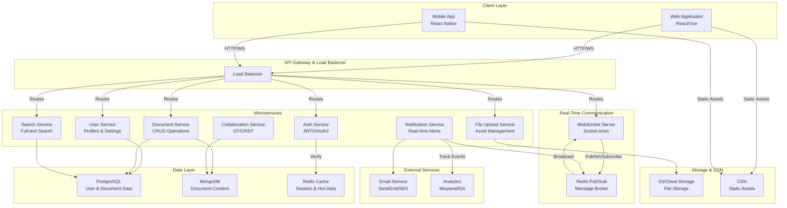

# Real-Time Collaboration Tool - Architecture Overview

## System Architecture

## Architecture Components

### Client Layer
- **Web Application**: React/Vue.js SPA for desktop and tablet users
- **Mobile App**: React Native for iOS and Android

### API Gateway
- **Load Balancer**: Distributes traffic across services
- Routes requests to appropriate microservices

### Microservices
1. **Auth Service**: User authentication, JWT tokens, OAuth2 integration
2. **User Service**: Profile management, settings, preferences
3. **Document Service**: CRUD operations for documents
4. **Collaboration Service**: Operational Transform (OT) or CRDT for real-time sync
5. **File Upload Service**: Asset management and storage orchestration
6. **Search Service**: Full-text search across documents
7. **Notification Service**: Real-time notifications and alerts

### Real-Time Communication
- **WebSocket Server**: Socket.io or native WebSocket for bidirectional communication
- **Redis Pub/Sub**: Message broker for inter-service communication and broadcasting

### Data Layer
- **PostgreSQL**: Relational data (users, documents metadata, permissions)
- **MongoDB**: NoSQL for document content and version history
- **Redis Cache**: Session storage, caching, real-time data

### Storage & CDN
- **Cloud Storage (S3)**: File uploads and asset storage
- **CDN**: Distributed delivery of static assets

### External Services
- **Email Service**: SendGrid or AWS SES for notifications
- **Analytics**: Mixpanel or Google Analytics for user tracking

## Data Flow Example: Real-Time Collaboration

1. User edits a document → Web client captures the change
2. Change is sent via WebSocket to the Collaboration Service
3. Service applies CRDT/OT algorithm to resolve conflicts
4. Change is published to Redis Pub/Sub
5. All connected clients receive the update via WebSocket
6. Document is persisted to MongoDB
7. Notification Service alerts other users in real-time

## Key Features

- ✅ Real-time collaborative editing
- ✅ Conflict-free synchronization
- ✅ Version history tracking
- ✅ Multi-user presence indicators
- ✅ Scalable microservices architecture
- ✅ High availability with load balancing
- ✅ Full-text search capabilities
- ✅ File sharing and management
